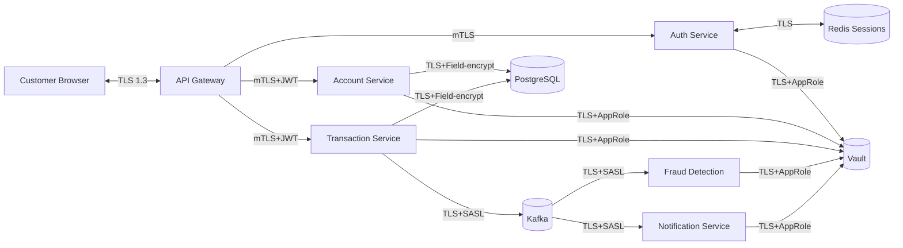

# Threat Model — SecureBank Platform

**Methodologies:** STRIDE + PASTA + DREAD scoring + MITRE ATT&CK technique mapping

---

## 1. System Decomposition

### 1.1 Trust Boundaries

```
[Internet] ──TB1──▶ [API Gateway] ──TB2──▶ [Service Mesh] ──TB3──▶ [Data Stores]
                                                                 └──▶ [Kafka Cluster]
                                                                 └──▶ [Vault]
```

- **TB1 (Public ↔ DMZ):** mTLS terminated, WAF, rate limit
- **TB2 (Gateway ↔ Service Mesh):** mTLS between every pod, NetworkPolicies enforced
- **TB3 (Services ↔ Data):** Encrypted connections only, service identity verified

### 1.2 Data Flow Diagram (Mermaid)



### 1.3 Assets

| Asset | Sensitivity | Owner |
|-------|-------------|-------|
| Customer PII (CNIC, address, phone) | High | Account Service |
| Account balances | High | Account Service |
| Transaction records | High | Transaction Service |
| Auth credentials | Critical | Auth Service |
| JWT signing keys | Critical | Vault |
| TLS private keys | Critical | Vault |
| ML fraud model weights | Medium | Fraud Service |
| Audit logs | High | All services |

## 2. STRIDE Analysis (per major component)

### 2.1 API Gateway

| Threat | STRIDE | Description | Mitigation |
|--------|--------|-------------|-----------|
| T-GW-1 | **S**poofing | Attacker impersonates a service via forged JWT | RS256 verification, JWKS rotation, `iss`/`aud`/`exp` strict checks |
| T-GW-2 | **T**ampering | Header injection (X-Forwarded-For poisoning) | Strip & re-set trusted headers; validate hop-by-hop |
| T-GW-3 | **R**epudiation | User denies transaction submission | Signed request log + idempotency key + audit trail |
| T-GW-4 | **I**nfo Disclosure | Verbose error reveals stack | Generic `5xx`, full detail only to logs |
| T-GW-5 | **D**oS | Volumetric flood | Rate limit per IP + per token + Cloudflare/WAF |
| T-GW-6 | **E**oP | Bypass via path traversal in routing | Strict path allow-list, normalize before route |

### 2.2 Auth Service

| Threat | STRIDE | Mitigation | MITRE |
|--------|--------|-----------|-------|
| T-AU-1 | S | Credential stuffing | Rate-limit, breached-password check, MFA | T1110.004 |
| T-AU-2 | S | OAuth code interception | PKCE required, `state` param | T1539 |
| T-AU-3 | T | Refresh token reuse | One-time refresh, sliding window, detection of reuse | — |
| T-AU-4 | R | "I didn't change my password" | Audit log + email notification | — |
| T-AU-5 | I | Timing attack on user lookup | Constant-time compare, dummy hash for unknown users | T1110 |
| T-AU-6 | D | Login endpoint DoS | Captcha after 3 failures, IP throttle | T1499 |
| T-AU-7 | E | Privilege escalation via role manipulation | RBAC stored server-side; JWT only contains a role ID | T1078 |

### 2.3 Transaction Service

| Threat | STRIDE | Mitigation |
|--------|--------|-----------|
| T-TX-1 | T | Race condition on balance check (TOCTOU) | DB row-lock + optimistic concurrency token |
| T-TX-2 | R | Disputed transfer | HMAC-signed request + immutable Kafka event |
| T-TX-3 | I | Account enumeration via "user not found" vs "insufficient funds" | Unified error response |
| T-TX-4 | D | Burst of micro-transfers | Per-user TX rate limit + ML anomaly |
| T-TX-5 | E | Currency conversion injection | Server-side rate lookup, never trust client-supplied rate |

### 2.4 Kafka

| Threat | STRIDE | Mitigation |
|--------|--------|-----------|
| T-K-1 | S | Rogue producer publishes | SASL/SCRAM + ACLs per topic |
| T-K-2 | T | Message tamper in transit | TLS + per-message HMAC |
| T-K-3 | R | Producer denies publish | Idempotent producer + transaction IDs |
| T-K-4 | I | Consumer reads forbidden topic | ACL deny by default |
| T-K-5 | D | Topic flooding | Quotas per principal |

### 2.5 Docker/Kubernetes Layer

| Threat | STRIDE | Mitigation |
|--------|--------|-----------|
| T-CO-1 | E | Container escape | Drop ALL caps, `readOnlyRootFilesystem`, seccomp `RuntimeDefault`, no privileged |
| T-CO-2 | T | Image tampering at pull | Cosign signature verification at admission |
| T-CO-3 | I | Mounted secret leaked via logs | Secrets from Vault as env or projected volume only; no `print(secret)` |
| T-CO-4 | E | RBAC over-grant | Per-service `ServiceAccount`, least-privilege Role |
| T-CO-5 | D | Resource exhaustion neighbor | Strict `requests`/`limits` + LimitRange + ResourceQuota |
| T-CO-6 | S | Pod-to-Pod east-west | NetworkPolicy default-deny + per-namespace allow rules |

## 3. PASTA Stage Summary

| Stage | Output |
|-------|--------|
| 1. Business Objectives | Customer trust, regulatory compliance, fraud loss < 0.1% |
| 2. Tech Scope | FastAPI, K8s, Kafka, Redis, PostgreSQL, Vault |
| 3. App Decomposition | See §1 |
| 4. Threat Analysis | See STRIDE matrices |
| 5. Vulnerability Analysis | SAST + DAST + pentest results, see `/reports` |
| 6. Attack Modelling | See Red Team scenarios (`06_red_blue_team.md`) |
| 7. Risk & Impact | See DREAD scoring §4 |

## 4. DREAD Risk Scoring (sample top 10)

| # | Threat | D | R | E | A | D | Score | Risk |
|---|--------|---|---|---|---|---|-------|------|
| 1 | Credential stuffing on `/auth/login` | 8 | 9 | 8 | 9 | 9 | 8.6 | **Critical** |
| 2 | TOCTOU on transfer balance | 9 | 5 | 7 | 6 | 4 | 6.2 | High |
| 3 | Container escape via privileged sidecar | 10 | 3 | 4 | 8 | 7 | 6.4 | High |
| 4 | Refresh token theft via XSS | 9 | 6 | 7 | 8 | 8 | 7.6 | High |
| 5 | Kafka rogue producer (insider) | 8 | 4 | 5 | 7 | 5 | 5.8 | Medium |
| 6 | Vault unseal key compromise | 10 | 2 | 3 | 5 | 4 | 4.8 | Medium |
| 7 | SSRF in webhook URL | 8 | 6 | 6 | 6 | 5 | 6.2 | High |
| 8 | RBAC over-grant in K8s | 9 | 4 | 5 | 8 | 6 | 6.4 | High |
| 9 | Log injection / CRLF | 4 | 6 | 6 | 5 | 4 | 5.0 | Medium |
| 10 | ML model evasion (fraud bypass) | 9 | 4 | 4 | 7 | 5 | 5.8 | Medium |

## 5. MITRE ATT&CK Mapping (Initial Access → Impact)

| ATT&CK Tactic | Technique ID | Technique | Mitigation in SecureBank |
|---------------|--------------|-----------|--------------------------|
| Initial Access | T1190 | Exploit Public-Facing App | WAF, SAST/DAST gates, dependency scanning |
| Initial Access | T1078 | Valid Accounts | MFA, breached-pw check, anomaly login |
| Execution | T1059 | Command/Scripting | Distroless images, no shell in runtime image |
| Persistence | T1525 | Implant Container Image | Cosign verification, immutable digests only |
| Priv Escalation | T1611 | Escape to Host | seccomp, no `CAP_SYS_ADMIN`, read-only fs |
| Defense Evasion | T1562.012 | Disable/Mod Linux Audit | Falco kernel-level, audit immutable, RBAC |
| Credential Access | T1552.001 | Creds in Files | Vault only, gitleaks/detect-secrets in CI |
| Discovery | T1613 | Container & Resource Discovery | RBAC deny `list pods` to workloads |
| Lateral Movement | T1021 | Remote Services | NetworkPolicy default-deny |
| Collection | T1530 | Cloud Data Object | Bucket policies, KMS, field-level encryption |
| C2 | T1071.001 | Web Protocols | Egress NetworkPolicy + DNS allow-list + Falco |
| Exfiltration | T1041 | Exfil over C2 | Egress NP + outbound traffic monitoring |
| Impact | T1496 | Resource Hijacking (crypto-mining) | LimitRange + Falco rule `Container drift` |
| Impact | T1486 | Data Encrypted for Impact (ransomware) | Backups (Velero) + offline copies + DR drills |

## 6. Threat Tracker Workflow

1. Threats logged in GitHub Issues with label `threat`.
2. Each threat references an ASVS control and a MITRE technique.
3. Status moves: `identified → triaged → mitigated → verified`.
4. Verification artifact attached (test result, ZAP report, Falco event, etc.).

## 7. Residual Risk

After mitigations, the following residual risks remain and are accepted by the Project Owner:

| Risk | Reason for Acceptance | Compensating Control |
|------|----------------------|----------------------|
| HSM-backed keys not used (ASVS V6 L3) | Out of scope for academic project | Vault Transit + auto-unseal + audit |
| External dependency 0-days | Inherent | SCA daily + image rebuild weekly |
| Insider threat (DBA) | Out of scope | Audit logs + 4-eyes on admin |

