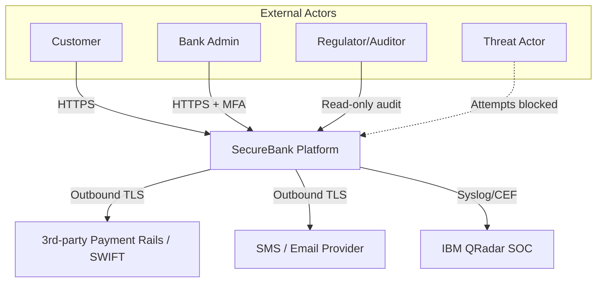
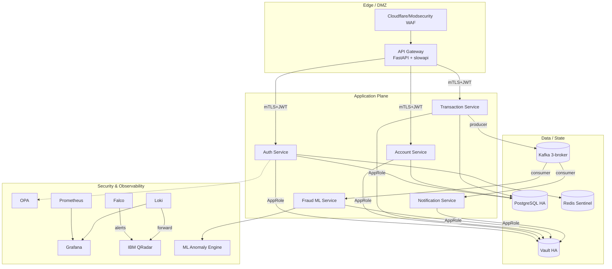
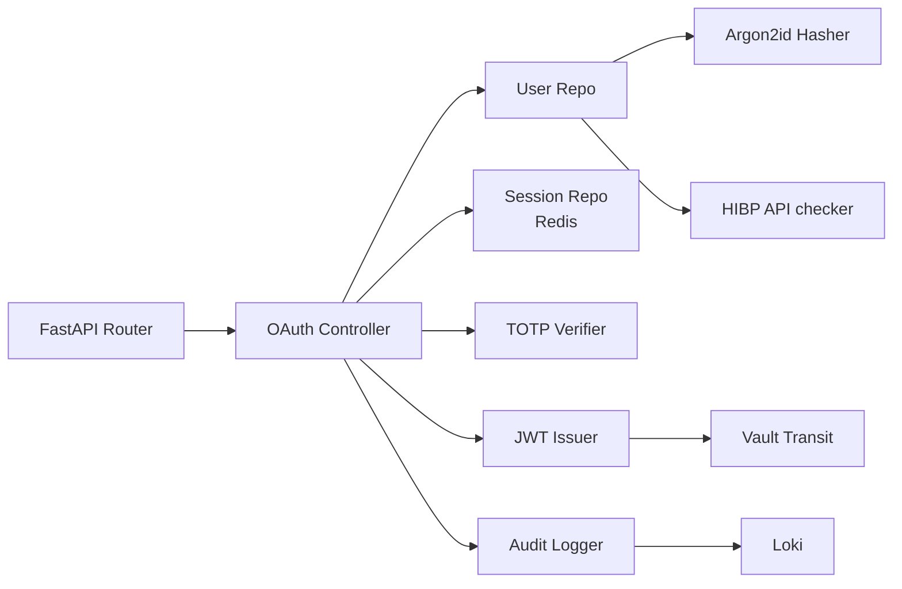

# Secure Architecture Blueprint — SecureBank

**Models used:** C4 (Context, Container, Component), SABSA layers, Zero Trust (NIST SP 800-207)

---

## 1. SABSA Layered View

| SABSA Layer | SecureBank Element |
|-------------|-------------------|
| **Contextual** | Customers, branch ops, regulators want trustworthy, available banking with auditable controls |
| **Conceptual** | Zero-Trust, Defense-in-Depth, Least-Privilege, Secure-by-Default, Fail-Closed |
| **Logical** | Microservices + Event-Driven (Kafka) + Identity-Aware Proxy + Policy-as-Code |
| **Physical** | Kubernetes (3-node control plane, ≥3 worker), Vault HA (3-node), Kafka (3 brokers), PostgreSQL HA, Redis Sentinel |
| **Component** | FastAPI services, OPA sidecar, Envoy gateway, Falco DaemonSet, Prometheus, Loki, Grafana |
| **Operational** | DevSecOps CI/CD, SOC playbooks, SRE on-call, IR plan |

## 2. Zero Trust — NIST SP 800-207 Mapping

| ZT Tenet | Implementation |
|----------|---------------|
| All data sources and services are resources | Each microservice has a unique SPIFFE-style identity & mTLS cert from Vault PKI |
| All communication is secured regardless of network location | mTLS everywhere; no plaintext in cluster |
| Access granted per-session | JWT max 15 min; refresh requires step-up where applicable |
| Access determined by dynamic policy | OPA evaluates user attributes + device posture + risk score |
| Monitor and measure integrity & security posture of assets | Falco, image signing (cosign), admission policies, kube-bench daily |
| Authentication & authorization strictly enforced before access | API Gateway + per-service authz; deny by default |
| Collect as much information as possible about the current state of assets, infrastructure, and communications | Prometheus + Loki + Falco events + OpenTelemetry traces → QRadar |

## 3. C4 — Level 1: System Context



## 4. C4 — Level 2: Containers



## 5. C4 — Level 3: Auth Service Components



## 6. Trust Boundary Diagram

```
                +-------------------+
   Internet --> |   Cloudflare WAF  |  TB-0 public ingress
                +-------------------+
                          |
                          v   TLS 1.3
                +-------------------+
                |   Ingress (NGINX) |  TB-1 cluster edge
                +-------------------+
                          |
                          v   mTLS
                +-------------------+
                |   API Gateway     |  TB-2 application edge
                +-------------------+
                          |
                          v   mTLS + JWT + OPA
            +--------------+----------------+
            |              |                |
        Auth Svc       Account Svc      Transaction Svc
            |              |                |
            +------+-------+--------+-------+
                   |                |
                   v  TLS + AES     v   TLS+SASL ACL
              Postgres          Kafka  →  Fraud / Notif
              (encrypted)
```

## 7. Identity & Access Architecture

- **Service identity:** Vault PKI issues short-lived (24 h) client/server certs to each pod via the Vault Agent injector sidecar. SPIFFE-style SAN: `spiffe://securebank/ns/<ns>/sa/<svc>`.
- **Human identity:** Keycloak (or built-in OAuth provider in `auth-service`) federates with university IdP for admins; customers use local OIDC with MFA.
- **Authorization:** OPA bundles distributed via the OPA bundle server; each service ships an `opa` sidecar evaluating REGO policies.
- **Audit:** Every authz decision (allow/deny + input) is logged with `decision_id`, replicated to Loki + QRadar.

## 8. Data Architecture & Encryption

| Data Class | At-Rest | In-Transit | Tokenization |
|------------|---------|------------|--------------|
| Auth secrets | Vault KV (auto-unseal) | TLS 1.3 | n/a |
| User PII | PostgreSQL TDE + column-level AES-256-GCM (Vault Transit) | TLS 1.3 | CNIC tokenized |
| Account balance | PostgreSQL TDE | TLS 1.3 | n/a |
| Transaction event | Kafka topic with `confluent.tier.feature.encryption=AES256` + per-message HMAC | TLS + SASL/SCRAM | account # tokenized |
| Audit | Loki (object store w/ SSE-KMS) | TLS | n/a |
| ML model weights | Vault KV | TLS | n/a |

## 9. Network Segmentation

| Namespace | Purpose | Default Network Policy |
|-----------|---------|------------------------|
| `securebank-edge` | API gateway | Ingress 443 only |
| `securebank-app` | App services | Allow from `edge`, deny inter-app except via Kafka |
| `securebank-data` | DB/Cache/Kafka | Allow from `app` only |
| `securebank-sec` | Vault, OPA bundles | Allow from `app`/`edge` |
| `securebank-obs` | Prometheus, Grafana, Loki | Scrape `app`+`data` |
| `kube-system` | System | Locked down |

## 10. Resilience & DR

- **Multi-AZ K8s** (sim. via 3 worker nodes labeled `topology.kubernetes.io/zone`)
- **Postgres** logical replication + WAL-G to S3-compatible object store; PITR
- **Kafka** RF=3, min.insync.replicas=2, MirrorMaker 2 to DR cluster
- **Vault** Raft storage, 3 nodes, auto-unseal via cloud KMS (or simulated transit unseal)
- **Backups encrypted** with rotated keys; restore drills monthly

## 11. Observability Architecture

```mermaid
flowchart LR
    APP[Services<br>(OpenTelemetry SDK)] --> COL[OTel Collector]
    COL --> PROM[Prometheus]
    COL --> LOKI[Loki]
    COL --> TEMP[Tempo Traces]
    FAL[Falco] --> COL
    PROM & LOKI & TEMP --> GRAF[Grafana]
    LOKI --> QR[QRadar]
    FAL --> QR
    PROM --> AM[Alertmanager] --> PD[PagerDuty/SMS]
```

## 12. Build & Supply-Chain Architecture

```
Developer commit
   │  pre-commit (gitleaks, ruff, bandit)
   ▼
GitHub PR
   │  SAST (SonarQube + CodeQL)
   │  SCA (pip-audit, Trivy fs)
   ▼
Merge to main
   │  Build image (multi-stage, distroless)
   │  Trivy image scan (FAIL on HIGH/CRIT)
   │  Cosign sign with Vault KMS
   │  SBOM (Syft) → attestation
   ▼
Registry (private, content-trust)
   │  Admission Controller verifies signature
   ▼
Cluster
```

## 13. Decision Records (Selected)

| ADR | Decision | Reason |
|-----|----------|--------|
| ADR-001 | FastAPI over Flask | Native async + Pydantic v2 input validation |
| ADR-002 | Kafka over Pulsar | Larger ecosystem; meets requirement; Strimzi operator mature |
| ADR-003 | Distroless base image | Removes shell → blocks T1059 |
| ADR-004 | OPA over Casbin | Industry standard, supports bundles, integrates with Gatekeeper |
| ADR-005 | Argon2id over bcrypt | Memory-hard, ASVS V2.4.1 recommendation |
| ADR-006 | Vault PKI for service certs | Short-lived certs, auto-rotation |
| ADR-007 | Kyverno + Gatekeeper both | Kyverno mutates (sidecar injection style), Gatekeeper validates with REGO |

## 14. Out of Scope

- HSM hardware (substituted by Vault Transit)
- Real SWIFT/IBFT integration (mocked)
- Real production traffic — academic demo only
